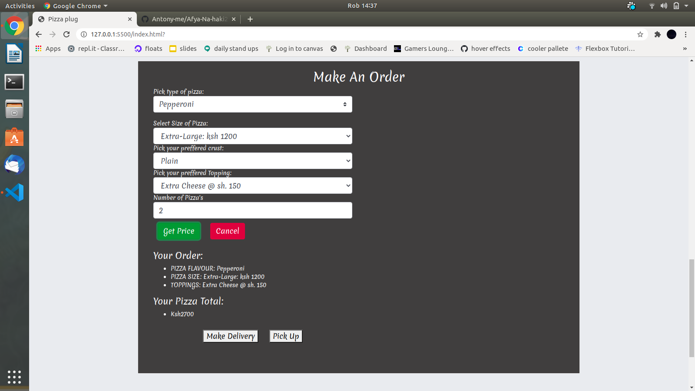

# Pizza-Plug.

## Author

[Antony Simiyu  Munyasia](https://github.com/Antony-me)

## Description
This is a web application for ordering Pizza



## How to run 

* Open terminal.

* Run   git clone ```https://github.com/Antony-me/pizza``` command.

* cd pizza - change directory.

* code . or atom . or a text editor of your choice.

## Technologies Used

* [HTML5](https://github.com/topics/html5)
* [CSS](https://github.com/topics/css3)
* [Bootstrap](https://github.com/topics/bootstrap)
* [jQuery](https://github.com/topics/javascript)


## BDD
| Behaviour      | Input        | Output       |
| :------------- | :----------: | -----------: |
|  Select Pizza flavour |    |   |
| select pizza size |  |  |
|select crust |  |     |
| select toppings|     | :----------:|
| Checkout the order| :----------: | -----------: |
| Enter delivery details| :----------: | -----------: |

## Known Bugs
* The site is not very responsive

## Contact Information 

[Email](antonymunyasia993@gmail.com)

#### Live Page https://antony-me.github.io/pizza/